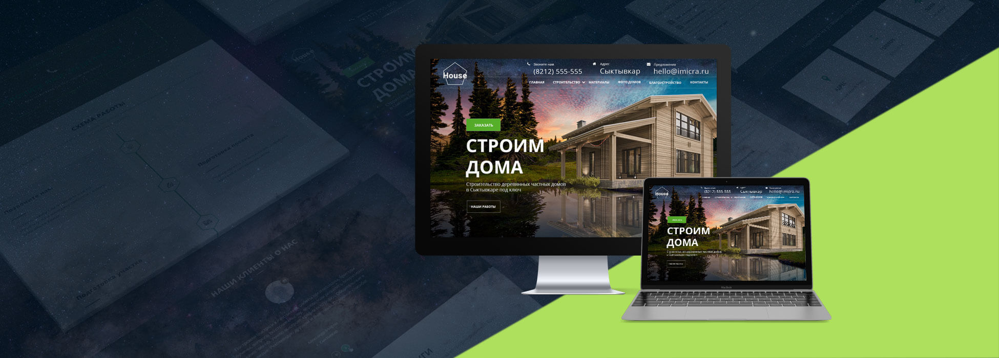
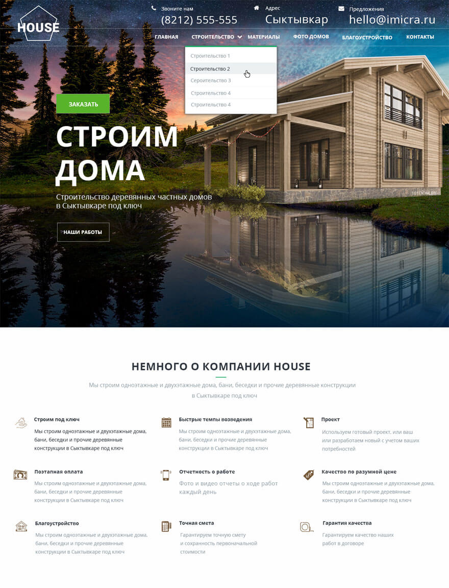
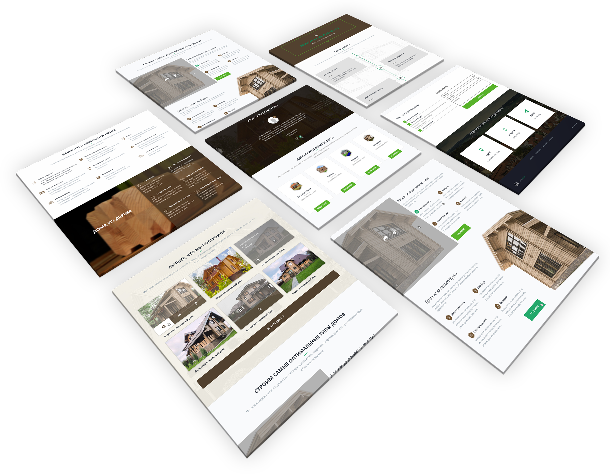
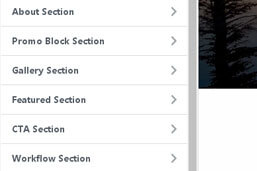
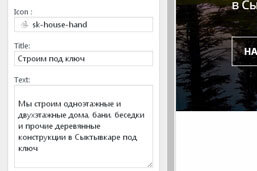
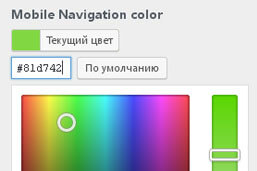
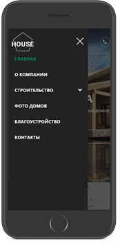

<h1>SKDom</h1>

My WordPress theme:
- Front Page is Landing Page
- Custom Post Types for Landing Pages sections and Pages
- Scroll to sections
- 2 types of Menu navigation
- Hiding Menu navigation
- Customization via Customizer
- Demo content
- Icons Packs

<h3>Front Page is Landing Page</h3>

<h3>Custom Post Types for sections</h3>

<h3>Customization via Customizer</h3>

<h3>Custom Post Types</h3>

<h3>Responsive design</h3>

I used boilerplate from _s.
